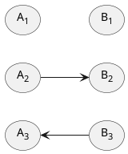
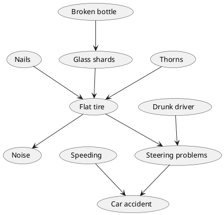
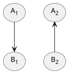
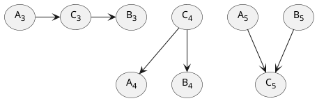
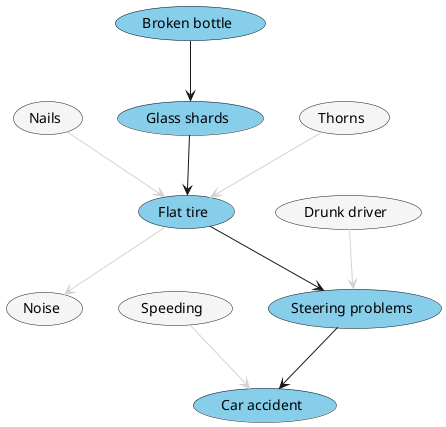
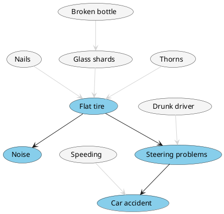
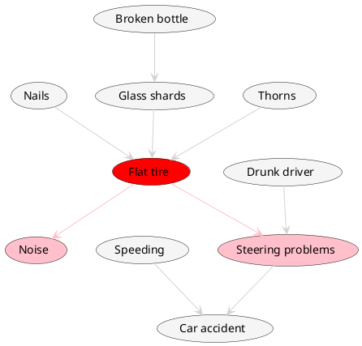
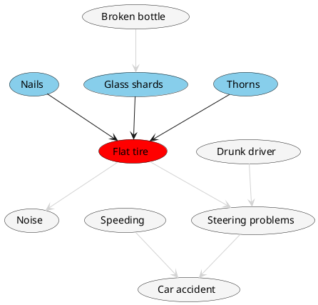
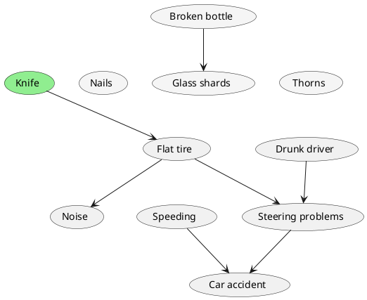

# {{ $slidev.configs.title }}

  M. Eng. Kasper Seweryn

---
layout: center
---

# Part 1: Bayes theorem

## https://tinyurl.com/5cr7ua2h

---
layout: center
---

”Steve is very shy and withdrawn, invariably helpful but with very little interest in people or in the world of reality. A meek and tidy soul, he has a need for order and structure, and a passion for detail.”

<v-click>
Which is more probable?
</v-click>

<v-clicks>

- A. Steve is a librarian.
- B. Steve is a farmer.

</v-clicks>

---
layout: center
---

”Linda is 31 years old, single, outspoken, and very bright. She majored in philosophy. As a student, she was deeply concerned with issues of discrimination and social justice, and also participated in anti-nuclear demonstrations.”

<v-click>
Which is more probable?
</v-click>

<v-clicks>

- A. Linda is a bank teller.
- B. Linda is a bank teller and is active in the feminist movement.

</v-clicks>

---

# Results

https://docs.google.com/forms/d/e/1FAIpQLSeebFSbE_yjU7P_MyTTZrX9ZcFaUxHgglIMMrKpag_G2lRJOw/viewanalytics

---
layout: center
---

# Bayes theorem

 

$$
P(H | E) = \frac{P(H)P(E | H)}{P(E)}
$$

---

# Is Steve a librarian?

$P(H_L | D) = \frac{P(H_L)P(D | H_L)}{P(D)}$

<v-click>

  ##### What is the ratio of librarians to farmers?
  

$P(H_{L}) =$
    <input v-model="ph" class="pl-2" />
  

</v-click>
<v-click>

  ##### What percent of librarians fit the description?
  

$P(D | H_{L}) =$
    <input v-model="peh" class="pl-2" />
  

</v-click>
<v-click>

  ##### What percent of farmers fit the description?
  

$P(D | H_{F}) =$
    <input v-model="penh" class="pl-2" />
  

</v-click>

  <v-click>

##### Knowing that

$P(D) = P(H_L)P(D | H_L) + P(H_F)P(D | H_F)$

  </v-click>

  <v-click>

##### We can plug everything into Bayes theorem

$P(H_L|D) = \frac{P(H_L)P(D | H_L)}{P(H_L)P(D | H_L) + P(H_F)P(D | H_F)} =$

$=$

{{ph}} $*$ {{peh}}

{{ph}} $*$ {{peh}} + (1 - {{ph}}) $*$ {{penh}}

$=$

{{ (ph * peh / (ph * peh + (1 - ph) * penh)).toFixed(5) }}

  </v-click>

---

# A visual approach to the problem

$P(H_L | D) = \frac{P(H_L)P(D | H_L)}{P(D)}$

  ##### What is the ratio of librarians to farmers?
  

$P(H_{L}) =$
    <input v-model="ph" class="pl-2" />
  

  ##### What percent of librarians fit the description?
  

$P(D | H_{L}) =$
    <input v-model="peh" class="pl-2" />
  

  ##### What percent of farmers fit the description?
  

$P(D | H_{F}) =$
    <input v-model="penh" class="pl-2" />
  

  

  

  
 (1 - peh) * 10}" class="p-1">
    

  

  

  

  
 (1 - penh) * 10}" class="p-1">
    

  

  

  

$P(H_L|D) =$

{{ph}} $*$

{{peh}}

{{ph}} $*$

{{peh}}

$+$

(1 $-$ {{ph}}) $*$

{{penh}}

$=$

{{ (ph * peh / (ph * peh + (1 - ph) * penh)).toFixed(5) }}

---

# Is Linda a feminist bank teller?
We could use Bayes theorem once again, or...

<v-click>

  

</v-click>

---
layout: center
---

# Part 2: Causal graphs

---

# What is causation?

Causation is a relationship between two variables where one variable (the cause) directly produces or influences the occurrence of the other variable (the effect).

<v-clicks>

- Pushing things off a table causes them to fall
- Smoking causes health issues
- Bringing up many controversial topics causes Kasper to express his strong opinions <v-click at="4">(force majeure)</v-click>

</v-clicks>

---

# How can we model causation?

Short answer: with DAGs

  <v-click>

</v-click>
<v-click>

</v-click>

---

# What about correlations?

Correlation is a statistical measure that indicates the extent to which two variables are linearly related, showing how changes in one variable are associated with changes in another.

<v-clicks>

- Reading ability and shoe size
- Wine consumption and heart attacks
- Ice cream consumption and shark attacks

</v-clicks>
 
<v-click>

# ”Correlation does not mean causation”
  

  It's truth, only truth but not the whole truth.

</v-click>

<v-click>

</v-click>
<v-click>

</v-click>

---
layout: center
---

# Part 3: Bayesian networks

---
layout: two-cols
---

# Bayesian networks

::right::

<v-clicks>

- Every variable has associated probabilities
- Let's us predict outcome of any variable given observations
- Allows us to incorporate expert's knowledge
- Allows us to predict effects of manipulation
- We can learn them from data!

</v-clicks>

---

# Markov condition

  

> Any variable is independent of it's non-descendants given it's parents.

<v-clicks>

  - Any two variables are dependent if there is a directed connection between them
  - A and B are dependent through C if there is a directed connection from C to A and from C to B
  - A and B are conditionally independent given C if C is a direct parent of A and B
  - A and B are conditionally dependent given C if there is a directed connection from A to C and from B to C

</v-clicks>

<v-click-gap size="-4" />

  

  <v-switch>
  <template #0>

  </template>
  <template #1>

  </template>
  <template #2>

  </template>
  <template #3>

  </template>
  <template #4>

  </template>
  </v-switch>

---

# Manipulation

  

> Given an external intervention on a variable A in a causal graph, we can derive the posterior probability distribution over the entire graph by simply modifying the conditional probability distribution of A.

If this manipulation is strong enough to set A to a specific value, we can view this intervention as the only cause of A and reflect this by removing all edges that are coming into A. Nothing else in the graph needs to be modified.

  <v-click>
      This is a powerful tool as it provides a systematic way to predict outcomes under hypothetical scenarios, even when direct experiments are infeasible
  </v-click>

  

---

# Example!
Example Bayesian Network

---

# Example!
Let's say that our patient tells us that he is a non-smoker

---

# Example!
We observe that he has a very short breath

---

# Example!
We suggest that he should take an XRay image and it turns abnormal

---

# Example!
Now, we ask him if he's been to Asia this year

---
layout: center
---

# Thank You for Your Attention!
